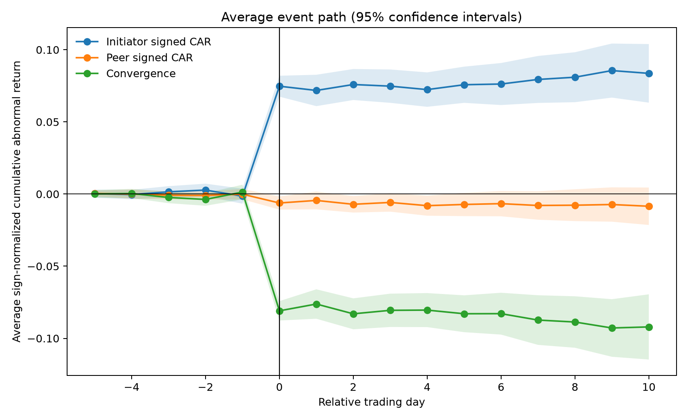
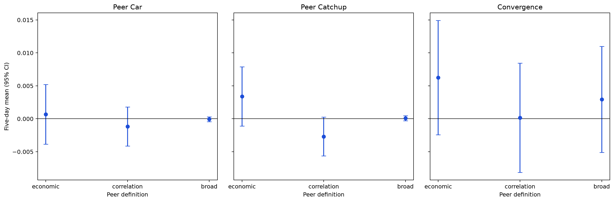
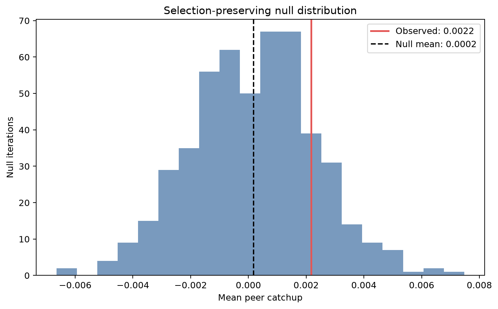
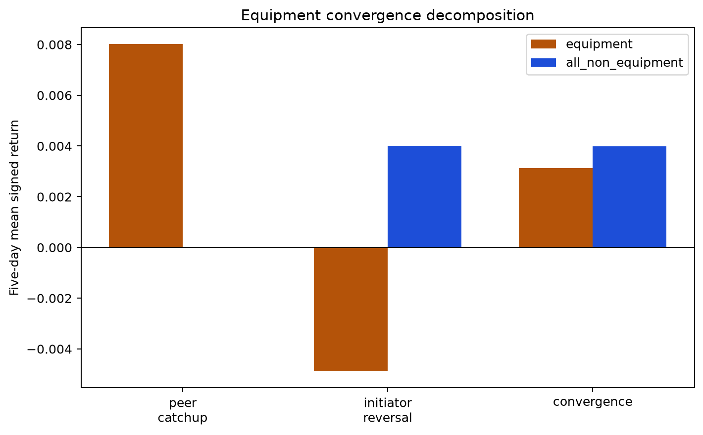

# Semiconductor Information Diffusion and Relative Price Discovery

I study what happens after one semiconductor stock moves unusually far from economically related peers. Do those peers catch up, does the initiating stock reverse, or does the gap simply remain?

## Research question

Semiconductor firms share customers, suppliers, technology cycles, and exposure to capital spending. A large move in one company may therefore contain information that matters for other firms, even when those firms do not react at the same time.

I treat the initial mover as the **initiator** and compare it with a leave-one-out portfolio of peers. For a positive or negative event with direction \(s \in \{+1,-1\}\), the post-event gap closure is

\[
\text{convergence} = \underbrace{s \times \text{peer CAR}}_{\text{peer catch-up}} + \underbrace{(-s) \times \text{initiator CAR}}_{\text{initiator reversal}}.
\]

A positive peer-catch-up value means peers moved in the direction of the original shock. A positive initiator-reversal value means the initiating stock moved back. This decomposition matters because the same convergence estimate can come from two different economic stories.

## What I found

The unconditional result was weak. Across 173 events with complete five-day outcomes, mean convergence was **+0.38%** and peer catch-up was **+0.22%**, but both confidence intervals included zero. Ten-day convergence was slightly negative. The baseline does not establish a general diffusion effect.

The clearest result appeared when I changed how peers were defined. On the same 131 five-day events, economic peers had **+0.34%** mean catch-up, while peers chosen from trailing return correlations had **−0.27%**. The paired economic-minus-correlation difference was:

> **+0.61% over five trading days**
>
> **95% paired-bootstrap CI: +0.16% to +1.05%; n = 131**

That is a relative result, not proof of absolute diffusion. A selection-preserving simulation redetected extreme events inside simulated returns and reran the study. At five days, the empirical p-values were about **0.17 for peer catch-up** and **0.13 for convergence**. The observed estimates were above the average null draw, but not unusually extreme under that benchmark.

Other results were secondary. Equipment-company events had +0.80% mean five-day peer catch-up, but −0.49% initiator reversal reduced total convergence to +0.31%. Lower prior semiconductor momentum was directionally associated with more convergence, although the result changed with the horizon. A pre-specified squared-shock test did not support nonlinear shock-magnitude effects, and the absolute catch-up estimate was not uniform across time periods.

## Why the result is interesting

Historical return correlation and economic relatedness are not the same thing. A correlation screen selects stocks whose returns happened to move together over a trailing window. An economic classification instead groups firms that occupy similar parts of the semiconductor value chain and may share demand, customers, input costs, or capital-spending exposure.

The result is therefore more specific than “semiconductor stocks move together.” For the same events, reviewed economic relationships contained incremental information about short-horizon cross-firm adjustment beyond the fixed trailing-correlation alternative. The comparison is paired and uses only pre-event information for correlation peers. It still does not show that an economic link caused the adjustment; common news, market timing, classification error, and omitted exposures remain possible explanations.

## Methodology

I manually reviewed a semiconductor universe and assigned firms to an economic peer taxonomy. Eligibility is dated and uses only information available through each date for price, history, and liquidity screens, although the current classification itself had to be applied retrospectively. Daily prices and volumes come from Yahoo Finance for 2015–2025.

The event signal is the initiator's return relative to an equal-weight, leave-one-out peer portfolio, after removing the same-day equal-weight semiconductor-sector return. An event requires an absolute relative move greater than both **5%** and **three times** shifted trailing 60-observation volatility. The detector also requires 60 prior observations, at least three eligible peers, and a five-day cooldown.

I measure peer catch-up, initiator reversal, and their sum over 1, 3, 5, and 10 trading days. Peer portfolios are frozen on the event date. Inference includes firm-clustered intervals, event/firm/date-block bootstraps, and a 10,000-draw paired bootstrap for the economic-versus-correlation comparison. Random-peer and matched pseudo-event placebos test peer identity and event timing. The stricter null preserves selection by simulating returns, redetecting extreme events, and then rebuilding outcomes instead of treating the observed event set as fixed.

## Research process

1. I froze a baseline event definition and found weak unconditional convergence.
2. I checked whether the result varied by subsector, event characteristics, and peer definition.
3. Economic peers looked more informative than correlation-selected or broad semiconductor peers.
4. I tested that comparison on identical events with strictly trailing correlation inputs and a paired bootstrap.
5. I then tried to disprove the result with alternative thresholds, horizons, return definitions, universes, placebos, dependence-aware bootstraps, time splits, and a selection-preserving null.

The relative peer-definition result survived most clearly. The broader claim that semiconductor shocks generally diffuse to peers did not.

## Key figures



**Baseline event path.** Day 0 is the selected initiator shock. Average post-event gap closure is small relative to the initial divergence, and the uncertainty bands widen with the horizon; this is a visual reason not to describe the baseline as strong convergence.



**Peer definitions on the common five-day sample.** Economic peers have positive mean catch-up while trailing-correlation peers have negative mean catch-up. The plotted intervals describe each level; the more informative paired economic-minus-correlation contrast is +0.61% (95% bootstrap CI +0.16% to +1.05%; n=131).



**Observed five-day peer catch-up against the selection-preserving null.** The observed +0.22% lies above the null mean, but only at the 83rd percentile (empirical p≈0.17). Extreme-event selection can produce apparent mean reversion, so this is an important limit on the absolute claim.



**Equipment events, decomposed.** Peers catch up by about +0.80% over five days, but the initiator continues in the shock direction on average, producing −0.49% initiator reversal. The offset leaves total convergence small and imprecise.

## Limitations

- Yahoo Finance is useful for exploratory daily research but is not an institutional point-in-time market database; adjusted histories can be revised.
- The economic classifications were manually reconstructed and applied retrospectively. The universe is not survivorship-free and has incomplete histories for delisted, acquired, renamed, and newly listed firms.
- International listings have different closing times, holidays, currencies, and information sets. A shared calendar date does not guarantee that one market could observe another market's close.
- I do not have complete event-level earnings or news classifications, so I cannot reliably separate firm-specific news from common semiconductor news.
- The frozen baseline has no broad-market benchmark. The sector adjustment is documented, but it is not a substitute for a full market model.
- Some subsectors and long-horizon common samples are small. Complete events fall from 226 at one day to 114 at ten days, and repeated firms and overlapping windows create dependence.
- This is an observational daily event study. It cannot establish causal information transmission, identify intraday leadership, or support a claim of tradable profits.

## Repository structure

- `src/price_diffusion/` — tested data, event-study, inference, mechanism, and robustness code.
- `notebooks/` — the research record, from data audits through the final synthesis.
- `metadata/` — reviewed security master and semiconductor classifications.
- `configs/` — frozen sample, eligibility, event, and inference choices; `final_baseline.yaml` is the empirical configuration.
- `outputs/` — compact tables, figures, diagnostics, and run manifests retained as evidence.

The detailed final memo is in [`research_notes/final_research_summary.md`](research_notes/final_research_summary.md), and the concise hypothesis record is [`outputs/robustness/final/evidence_table.csv`](outputs/robustness/final/evidence_table.csv).

## Reproducing the analysis

Create an environment from the repository root:

```bash
python -m venv .venv
source .venv/bin/activate
python -m pip install --upgrade pip
python -m pip install -e ".[dev]"
```

The raw and processed price files are intentionally excluded from Git. To acquire a new immutable Yahoo snapshot, open `notebooks/00_data_acquisition_audit.ipynb`, review the security mapping, and deliberately set `RUN_DOWNLOAD = True`. Then build the audited panel and frozen baseline:

```bash
python -m price_diffusion.stage11d
python -m price_diffusion.baseline
```

Use `configs/final_baseline.yaml`; `configs/baseline.yaml` is an earlier design scaffold. The human-readable notebook sequence is data audit (`00`, `01`), baseline (`05`), exploratory diagnosis (`06`–`09`), fixed mechanism tests (`10`–`13`), and robustness/final synthesis (`14`–`17`). The null notebook is intentionally expensive and does not need to be rerun just to inspect the stored results.

Run the lightweight test suite with:

```bash
python -m pytest -q
```
